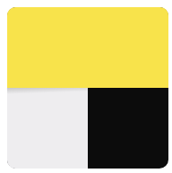

# Отбор Young con

## Навигация
- [A. Пещеры на далекой планете](#a-пещеры-на-далекой-планете)
- [B. Беда в орбитальном хранилище](#b-беда-в-орбитальном-хранилище)
- [C. Традиции](#c-традиции)
- [D. Скопление Энергии](#d-скопление-энергии)
- [E. Логотип для межгалактического билборда](#e-логотип-для-межгалактического-билборда)

[A. Пещеры на далекой планете](https://github.com/danula-ded/Test_Young-con_frontend/blob/main/A/code.js)
============================

Исследователь-одиночка из Мира Странников путешествует по Вселенной в поисках древних сокровищ. Поиски завели его в систему двумерных пещер на далекой планете. Исследователь вспомнил, что когда-то уже бывал здесь. В молодости он писал научную работу по пещерам такого типа и собирал данные именно в этой системе пещер. Исследователь вручную подсчитывал и записывал количество сталактитов, сталагмитов и сталагнатов. Можно было легко ошибиться и приходилось проверять себя несколько раз.

Исследователь решил проверить свои старые расчёты — не зря же у него теперь есть портативный сканер местности! Сканер переводит всё в матрицу из 0 и 1, где первая строчка — ближайшая к потолку, а последняя строчка — ближайшая к полу. Только вот незадача, нет возможности узнать количество объектов на карте. При этом объектом считается непрерывная область из единиц. Но для знаменитого археолога нет непреодолимых препятствий!

Нужно реализовать метод scan, который принимает на вход карту — матрицу NxM, состоящую только из 1 (каменная порода) и 0 (пустое пространство). Матрица — это 2D-карта пещеры с видом сбоку.

Формат ввода
------------

Нужно реализовать метод scan, который принимает на вход карту — матрицу NxM, состоящую только из 1 (каменная порода) и 0 (пустое пространство). Матрица — это 2D карта пещеры, вид сбоку, как в играх-платформерах.  
  
Пример карты:

\[    
  \[1, 1, 0, 0, 0, 1, 0, 1, 1\],    
  \[1, 1, 0, 1, 0, 1, 0, 0, 0\],    
  \[0, 1, 0, 1, 0, 0, 0, 1, 1\]    
\]

  
Метод экспортировать таким образом:

module.exports = { scan };

Проверяться будет результат вывода:

scan(\[...массив с картой...\]);

Формат вывода
-------------

Метод scan возвращает объект с количеством каждого типа образования {ceil: 0, floor: 0, both: 0}  
  
\- Если объект свисает с потолка и не касается пола — ceil  
\- Если объект растёт от пола и не касается потолка — floor  
\- Если объект свисает с потолка и при этом ещё и касается пола — both

Результат вывода на примере карты выше: {ceil: 2, floor: 2, both: 1}

Примечания
----------

У одного объекта может быть несколько точек касания.  
  
1\. Пример:

\[    
  \[1, 0, 1\],    
  \[1, 1, 1\],    
  \[0, 0, 0\]    
\]

Результат: {ceil: 1, floor: 0, both: 0}  
  
2\. Пример:

\[    
  \[1, 0, 1\],    
  \[1, 1, 1\],    
  \[0, 0, 1\]    
\]

Результат: {ceil: 0, floor: 0, both: 1}  
  
Считаем, что по диагонали объекты не пересекаются:

\[    
  \[1, 0, 1\],    
  \[0, 1, 0\],    
\]

Результат: {ceil: 2, floor: 1, both: 0}

[B. Беда в орбитальном хранилище](https://github.com/danula-ded/Test_Young-con_frontend/blob/main/B/code.js)
===============================

В Мир Хранителей стекаются данные со всей Вселенной Яндекса. Информация хранится в бесконечных орбитальных хранилищах. В одном из хранилищ работает архивариус Рик.

Рик — минималист, поэтому всегда называет файлы file и использует собственную асинхронную файловую систему, которая базируется на объекте Folder c двумя методами:

   
type File = string | Folder | {} | null | undefined;    
   
type Folder = {    
  // Получить по индексу файл или папку    
  read(index: number, callback: (file: File) => void): void;    
   
  // Получить количество элементов в директории    
  size(callback: (size: number) => void): void;    
}    

Недавно у Рика произошла беда. Магнитная буря заметно потрепала файлы в его хранилище. Урон от бури оказался серьёзным, но не фатальным. Часть файлов осталась без повреждений, часть — потеряна навсегда, потому что превратилась в null или {}. Ещё часть повреждена, но, кажется, может быть восстановлена. Понять, что файл повреждён, очень просто — часть букв в названии продублировались. Помогите Рику найти все такие файлы и сложите их в массив для дальнейшего анализа. Массив надо отсортировать лексикографически.

Формат ввода
------------

Объект с определённой структурой:

   
Folder(\[    
    ’file’,    
    ’ffffile’,    
    Folder(\[    
        ’file’,    
    \]),    
    Folder(\[    
        ’fiiile’,    
    \]),    
    Folder(\[    
        {},    
        null,    
        ’file’,    
        ’ffiillee’,    
        ’ffiillee’,    
    \]),    
    Folder(\[    
        Folder(\[    
            ’filllle’,    
            ’file’,    
            null,    
        \]),    
        {},    
        Folder(\[\]),    
    \]),    
\]);

Формат вывода
-------------

Массив строк, отсортированный в лексикографическом порядке:

   
\[    
    ’ffffile’,    
    ’ffiillee’,    
    ’ffiillee’,    
    ’fiiile’,    
    ’filllle’,    
\]

Примечания
----------

Задачу требуется решить на JavaScript (ES2017) и оформить решение по шаблону:

   
module.exports = async function(input) {    
    // ...    
    return result;    
}

[C. Традиции](https://github.com/danula-ded/Test_Young-con_frontend/blob/main/C/code.js)
===========

Антропологи Вселенной Яндекса исследуют культуру Мира Маны. Исследователи обнаружили, что обитатели этого Мира коллекционируют кристаллы. В местной культуре принято упорядочивать кристаллы по неубыванию массы. Также традиции предписывают скреплять дружбу с помощью объединения двух коллекций.

Представьте, что коллекции кристаллов двух жителей — это два отсортированных целочисленных массива n u m s 1 nums1 nums1 и n u m s 2 nums2 nums2. Помогите антропологам смоделировать процесс объединения коллекций. Поместите все элементы n u m s 2 nums2 nums2 в n u m s 1 nums1 nums1 так, чтобы элементы итогового массива остались отсортированными.

Формат ввода
------------

\[46,55,88,0,0,0,0\] 3 \[18,29,80,90\] 4

Примечания
----------

*   количество элементов в массивах n u m s 1 nums1 nums1 и n u m s 2 nums2 nums2 равны m и n соответственно;
*   можно считать, что в массиве n u m s 1 nums1 nums1 зарезервировано место для всех элементов ( n + m ) (n + m) (n+m) и заполнены нулями;
*   результат должен сохраниться в переменной n u m s 1 nums1 nums1, результат функции явно возвращать не обязательно

    /**
     * @param {number[]} nums1 - первый отсортированный массив
     * @param {number} m - количество значимых элементов в nums1
     * @param {number[]} nums2 - второй отсортированный массив
     * @param {number} n - количество элементов в nums2
     * @return {void} Не возвращайте ничего, вместо этого модифицируйте nums1.
     */
    module.exports = function merge(nums1, m, nums2, n) {
       // ваш код здесь
    }

[D. Скопление Энергии](https://github.com/danula-ded/Test_Young-con_frontend/blob/main/D/code.js)
====================

Создатели Вселенной Яндекса используют Энергию Технологий, чтобы воздвигать новые Миры.

Энергия концентрируется в сгустках, масса каждого из которых выражается целым числом. По физическим законам Вселенной Яндекса можно создать новый Мир только при слиянии двух сгустков, и при условии, что их общая масса будет равна k k k.

Создатели периодически открывают разные скопления сгустков Энергии. Представим одно такое скопление в виде массива целых чисел.

Создатели намерены творить Миры! Помогите им научиться определять, что в заданном скоплении есть два сгустка Энергии общей массой k k k.

**Пример:**

Вход: nums = \[10, 15, 3, 7\], k = 17

Выход: \[10, 7\]

Примечания
----------

В качестве решения предоставьте функцию следующего вида, возвращающую true или false:

    
    module.exports = function isThereAPairOfNumbers(arr, k) {
    …
    };

[E. Логотип для межгалактического билборда](https://github.com/danula-ded/Test_Young-con_frontend/blob/main/E/solution.css)
=========================================

Жители Мира Странников очень гордятся своим сервисом Яндекс Go и хотят рассказать о нём всей Вселенной. Дизайнеры разработали логотип Go, чтобы распространить его по Мирам.

Логотип будут использовать в разных условиях, например, на гигантском межгалактическом билборде. Билборд увидят обитатели всех Миров Вселенной Яндекса. Чтобы это было максимально удобно, сверстайте его с помощью одного HTML-элемента на чистом CSS. Использовать картинки (даже через data:uri) нельзя.

Примечания
----------

### Размеры

Общая ширина: 192px

Общая высота: 192px

Высота желтой секции: 96px

Ширина белой секции: 96px

Радиус скругления: 36px

### Цвета

Черный: `#000`

Желтый: линейный градиент под углом 145 градусов от `#fcdd2e` до `#fcb600`

Белый: `#f5f4f0`

### Тень

На белую часть сверху падает тень, она представляет из себя полоску высотой 7px под углом 178 градусов, где самый тёмный участок окрашен в чёрный с прозрачностью 18%.

### Решение нужно предоставить в виде CSS-файла.

Ваш файл будет подключен как solution.css к HTML-странице вида:

    <!DOCTYPE html>
    <html>
        <head>
            <meta http-equiv="Content-Security-Policy" content="default-src 'self'; style-src 'unsafe-inline' 'self'"/>
            
            <link rel="stylesheet" href="solution.css">
        </head>
        <body>
            

        </body>
    </html>
